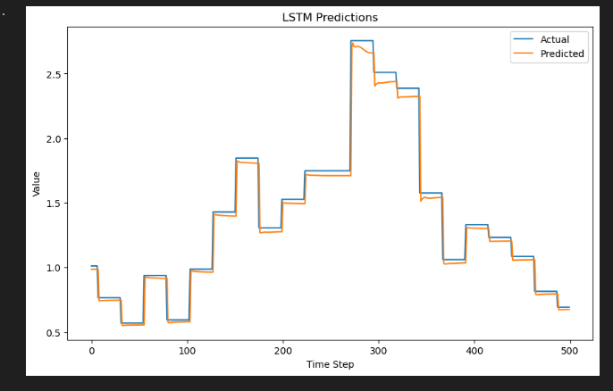

### Introduction
Long Short-Term Memory (LSTM) is a type of recurrent neural network (RNN) that is commonly used for sequence modeling, particularly for processing time-series data. Unlike traditional RNNs, LSTMs have a memory cell that allows them to selectively remember or forget information over time, which makes them particularly useful for long-term dependencies.

In this project, we'll use Pytorch to build an LSTM model that can predict a time-series based on previous data. We'll use numpy and pandas to preprocess the data.

### Result

